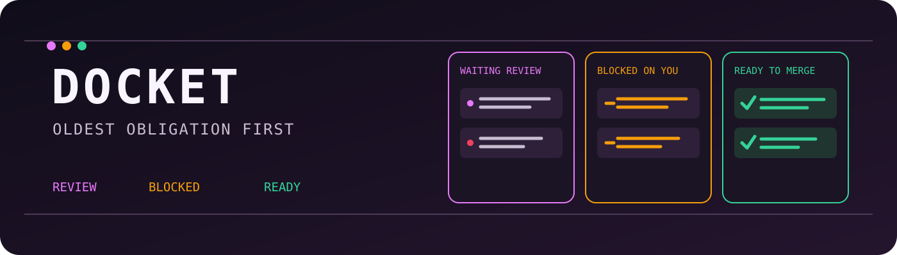

# Docket



Docket turns GitHub pull requests into an obligation queue for action, not scrolling. It separates
requests waiting on your review, your own blocked work, and branches ready to merge, then sorts
each lane oldest first. A configurable review clock marks overdue work before it disappears in the
feed. Drain a row when handled; it returns automatically when the pull request changes. One bounded
GraphQL poll every 15 minutes keeps the bar quiet while credentials remain local.

Not a GitHub dashboard. Not a feed. One question, answered on the bar: what do I owe right now,
and what am I already late on. When you owe nothing, the widget disappears from the bar entirely.

[](https://ko-fi.com/U5S225PTME)

## What it shows

Three lanes, ordered oldest obligation first, because the thing that has been waiting longest is
the thing you owe and newest-first ordering buries it.

| Lane | What lands there |
| --- | --- |
| **Waiting on your review** | Open pull requests where your review was requested. |
| **Blocked on you** | Your own open pull requests with changes requested, merge conflicts, or failing checks. |
| **Ready to merge** | Your own pull requests that are approved, green, and mergeable. |

A pull request whose only problem is that somebody else has not reviewed it yet is **not** on your
docket. It is not your move.

Each search fetches one page of 50, ordered **oldest first**, because on a busy account the page
boundary decides which obligations are reachable at all and newest-first would make the oldest ones
permanently unfetchable. When there is more than a page, the panel says so: `172 newer not fetched`.
A lane that renders fewer rows than it holds says that too: `12 more in this lane, not shown`. The
pill counts the whole queue, so `c` drains more than what is on screen, deliberately.

## The review clock

Every row carries an age measured from the pull request's last activity. Past your configured
clock (24 hours by default) the row gets a marker, the age turns the bar alert color, and the
pill switches from `3 to review` to `2 overdue`.

This is the part no other GitHub bar widget does. Plenty of them tell you what is waiting. This
one tells you what you are late on.

## Draining

Press `x` on a row and it leaves the docket. The dismissal is bound to that pull request's
`updatedAt`, not to its number: the moment somebody pushes, reviews, or comments, the stamp
changes and the row comes straight back. You cannot permanently mute an obligation, only defer
one until it moves.

Opening a pull request never drains it. Reading is not discharging.

`u` restores everything you drained. It is not a single-step undo; there is no undo for the undo.

A drained pull request that changes comes back to the docket **without** a fresh notification. The
drain is keyed on the pull request's stamp and the notification bookkeeping is keyed on its id, so a
returning row is not new to the notifier. That is deliberate: a row you already chose to defer
should reappear quietly.

## Install

```
omarchy plugin add https://github.com/jeremylongshore/omarchy-docket-entry --enable
```

Then add the **Docket** widget to a bar zone in Omarchy's settings.

## Connect

`omarchy plugin add` clones this repository to
`~/.config/omarchy/plugins/io.github.jeremylongshore.docket/`, and Omarchy does not put a plugin's
`bin/` on your `PATH`. Symlink the helper once into `~/.local/bin`, which Omarchy's
`env-bootstrap` does put on `PATH`:

```
ln -s ~/.config/omarchy/plugins/io.github.jeremylongshore.docket/bin/docket-login \
      ~/.local/bin/docket-login
```

Then:

```
gh auth token | docket-login
```

Without the symlink, call it by its full path. If you do not have the `gh` CLI, run `docket-login`
with no arguments and paste a token at the prompt, or pipe one in:
`printf %s "$TOKEN" | docket-login`. Answering `n` to the gh-import prompt gets you the paste
prompt, not gh's token.

The token is read from stdin and never from a command-line flag, because a process command line
is world readable. See [SECURITY.md](SECURITY.md).

**Scopes.** `repo` is the minimum that sees everything, because private pull requests really do
appear in a review queue. `public_repo` works and silently omits every private one. A fine-grained
token wants **Pull requests: Read** plus **Contents: Read** (Contents is what makes the check
rollup readable), and is the better choice: classic `repo` is read *and write* on every private
repository you can reach, which is a wide blast radius for a desktop widget to hold. Set an expiry.

There is no unauthenticated mode. GitHub cannot resolve `@me` without a token: the search endpoint
answers HTTP 422 and the GraphQL endpoint answers HTTP 403. Until a token is present the widget
renders one setup tile, never an empty list and never a zero count.

To disconnect:

```
docket-login --forget
```

Deleting the credentials file is not revocation. Revoke the token at
`https://github.com/settings/tokens`.

## Keys

| Key | Action |
| --- | --- |
| `j` / `k`, arrows | Move the cursor |
| `Enter`, `Space`, `o` | Open the selected pull request in your browser |
| `x` | Drain the selected row until that pull request changes |
| `c` | Drain everything currently on the docket |
| `u` | Restore everything you have drained |
| `r` | Refresh now |
| `Tab` | Switch to the next bar panel |
| `Esc` | Close |

Left click opens a row. Right click drains it. Middle click on the bar pill refreshes.

## Settings

| Setting | Default | What it does |
| --- | --- | --- |
| Desktop notifications | On | Notify when a pull request newly lands on your docket. Never on the first run, never on an error. |
| Review clock (hours) | 24 | How long something may sit before it counts as overdue. Clamped to 1 to 168. |
| Bot-authored pull requests | Hide | Dependency bots open more review requests than people do and never age out. On the account this was built against, hiding them removed 35 of 59 rows. |
| Your own drafts | Hide | A draft is waiting on you by definition, so showing them drowns the real signal. |

## Requirements

**No node, python, or ruby is required.** A stock Omarchy install has none of them on the
graphical session PATH, so a plugin with an external poller installs cleanly, enables cleanly, and
then silently never populates. Docket runs entirely inside Quickshell and uses only tools Omarchy
already ships: `curl`, `jq` (login helper only), `xdg-open`, and `omarchy-notification-send`.

Node appears in this repository in exactly one place: the offline unit suite under `tests/`, which
never runs on a user machine and never touches the network.

## Cost

One GraphQL POST per poll answers both inboxes. Measured live on 2026-08-21: 2 rate-limit points
out of a 5000-point hourly budget, so the default 15-minute cadence spends 8 points an hour, or
0.16 percent. The REST search API was rejected for this: it needs two requests against a
30-per-minute budget, carries no ETag, and has no CI, review-decision, or mergeable field anywhere
in a search item.

## Removal

```
omarchy plugin remove io.github.jeremylongshore.docket
```

Then remove the widget from your bar layout, and delete the plugin's own state:

```
docket-login --forget          # or the full path, if you did not symlink it
rm -f ~/.local/bin/docket-login
rm -rf "${XDG_STATE_HOME:-$HOME/.local/state}/omarchy/docket"
```

Revoke the token at `https://github.com/settings/tokens`. Docket writes nothing outside that one
state directory.

## Tests

```
node --test tests/*.test.js
```

The complete suite is offline and runs against captured or scrubbed GitHub API response bodies.
Coverage, repeated concurrent runs, mutation testing, security races, presentation gates, and the
Buzz production render journey are all fail-closed release requirements.
Recapture procedure: [docs/FIXTURES.md](docs/FIXTURES.md).

## License

MIT. See [LICENSE](LICENSE).
